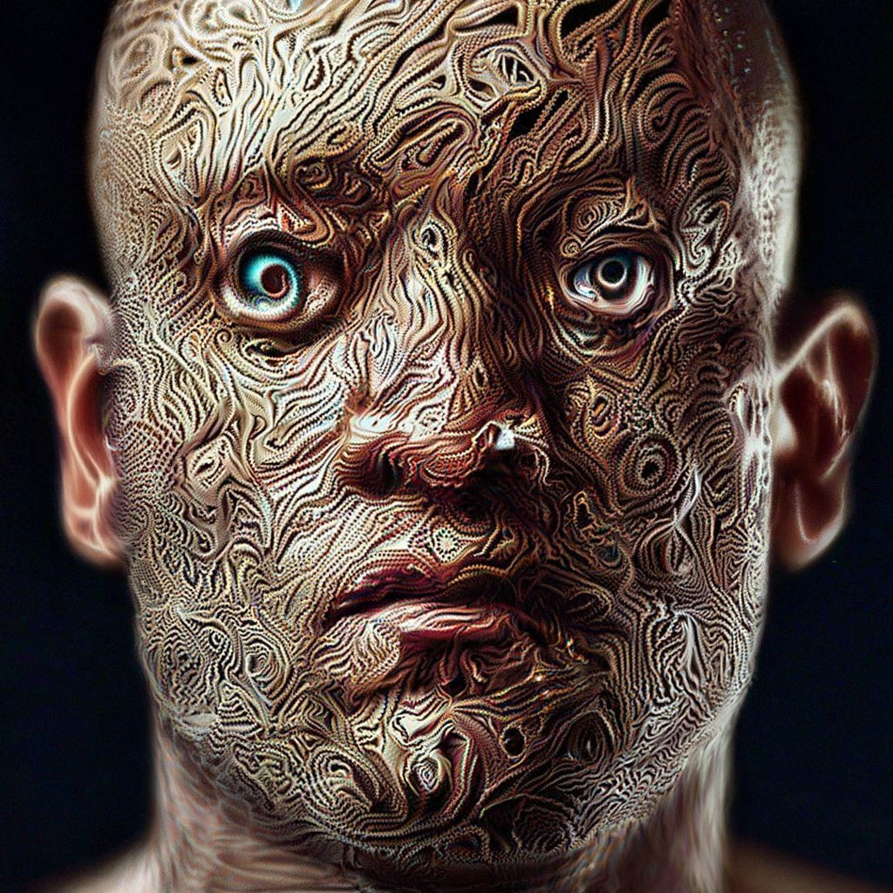

# 🤖 **HandCursor course-work**

### **Система бесконтактного управления компьютером через жесты руки**

**Превратите вашу веб-камеру в мощный контроллер жестов!**

---

## 📋 **Оглавление**

1. [👥 Команда разработчиков](#-команда-разработчиков)
2. [🎯 Тема и цели проекта](#-тема-и-цели-проекта)
4. [🖥️ Установка](#️-установка)
5. [🎮 Использование](#-использование)
6. [🔧 Техническая документация](#-техническая-документация)
7. [📁 Структура проекта](#-структура-проекта)
8. [🧪 Тестирование](#-тестирование)
10. [📈 Планы развития](#-планы-развития)

---

## 👥 **Команда разработчиков**

| Фото | ФИО | Роль | Навыки |
|------|-----|------|--------|
|  | **Бондарев Иван Андреевич** [@Bondarev4](https://github.com/Bondarev4) | Главный разработчик| • Professional computer user

### **Группа:** Д-Э 311
**Институт:** Экономики и управления АПК
**Направление:** 09.03.02 "Информационные системы и технологии"  
**Учебное заведение:** РГАУ-МСХА им. Тимирязева  
**Период:** 2023-2027 учебный год

---

## 🎯 **Тема и цели проекта**

### **Тема проекта**
**"HandCursor: Интеллектуальная система бесконтактного управления интерфейсом компьютера на основе распознавания жестов руки в реальном времени"**

### **Цель проекта**
Разработка доступной, высокоточный и интуитивно понятной системы управления курсором мыши через распознавание жестов руки с использованием стандартной веб-камеры, обеспечивающей:
- Альтернативный метод взаимодействия с компьютером
- Повышение доступности для людей с ограниченными возможностями (нет денех купить мышку)
- Инновационный подход к человеко-машинному взаимодействию

### **Задачи проекта**

#### **Технические задачи:**
1. ✅ Реализация стабильного детектора положения руки в пространстве
2. ✅ Классификация 8+ различных жестов с точностью >95%
3. ✅ Точное маппинг координат руки в координаты экрана
4. ✅ Реализация полного набора действий мыши:
   - Перемещение курсора
   - Левый/правый клик
   - Двойной клик
   - Drag & Drop
   - Скроллинг вверх/вниз
5. ✅ Оптимизация для работы на оборудовании среднего уровня

#### **Научно-исследовательские задачи:**
1. ✅ Анализ существующих решений в области бесконтактного управления
2. ✅ Разработка алгоритма сглаживания движений
3. ✅ Создание датасета жестов для обучения модели
4. ✅ Исследование точности различных подходов к трекингу

#### **Практические задачи:**
1. ✅ Написание подробной документации
2. ✅ Создание системы тестирования

### **Аннотация**
**HandCursor ** - это система, которая превращает обычную веб-камеру в полноценный контроллер жестов. Проект сочетает в себе передовые технологии компьютерного зрения, машинного обучения и эргономичного дизайна для создания естественного и эффективного способа взаимодействия с компьютером.

---
