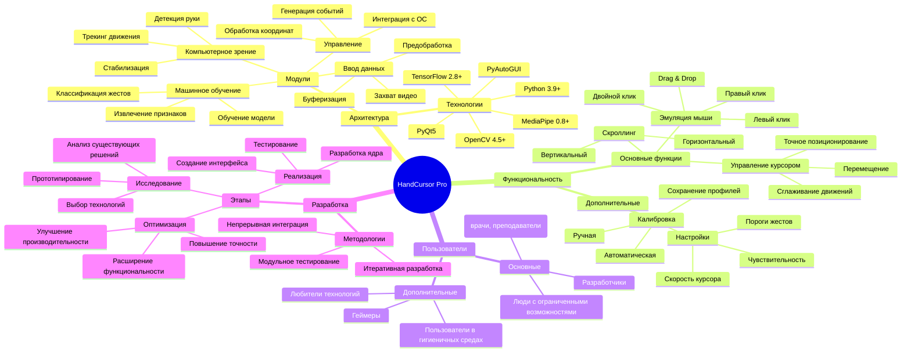
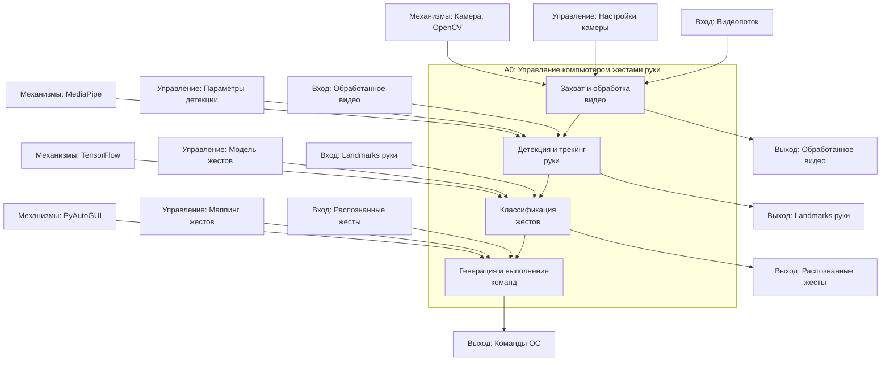
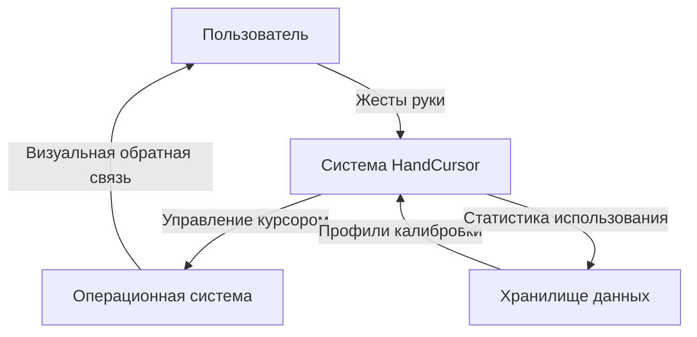
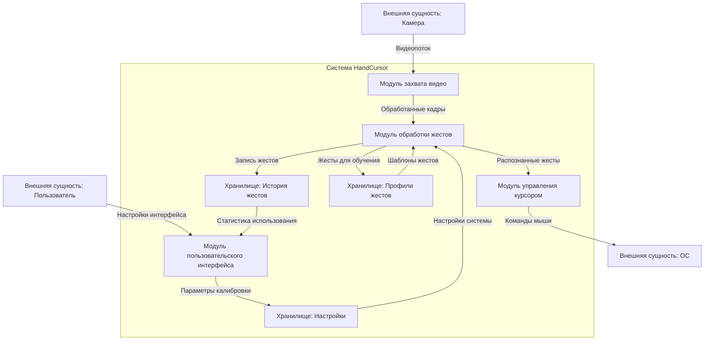
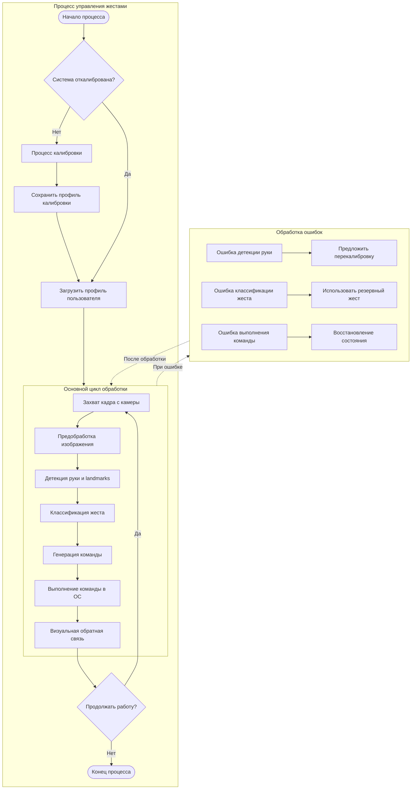
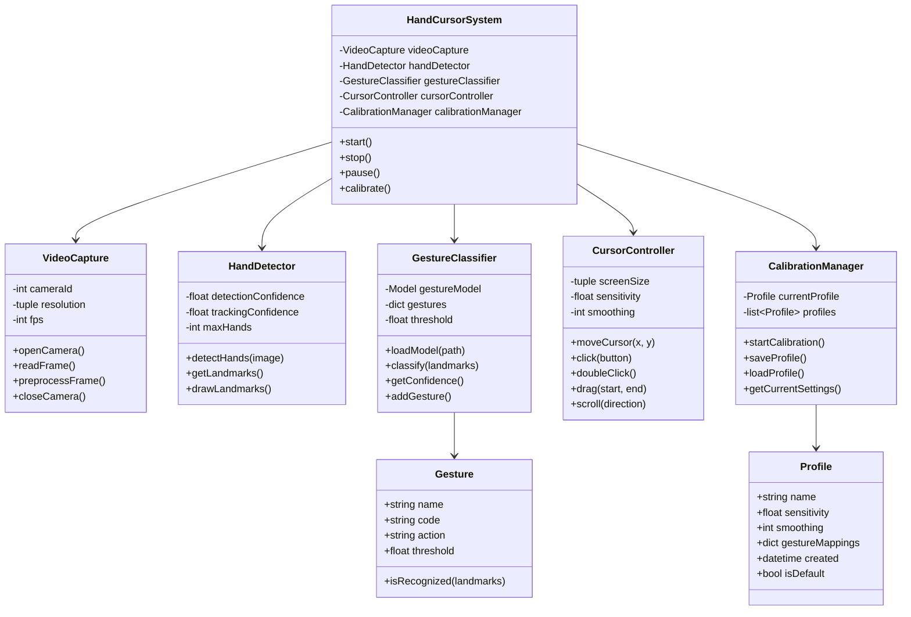
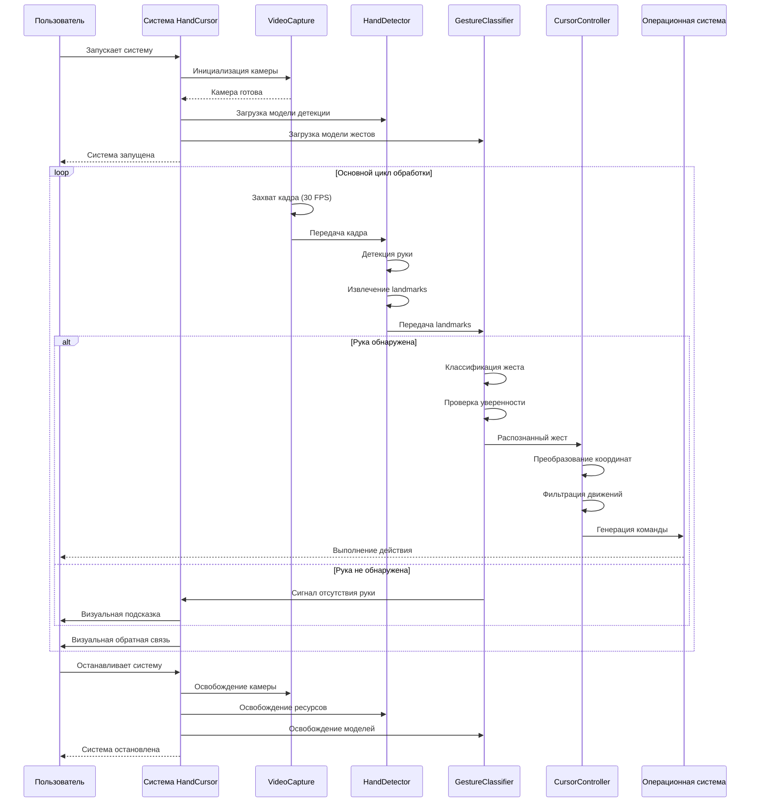
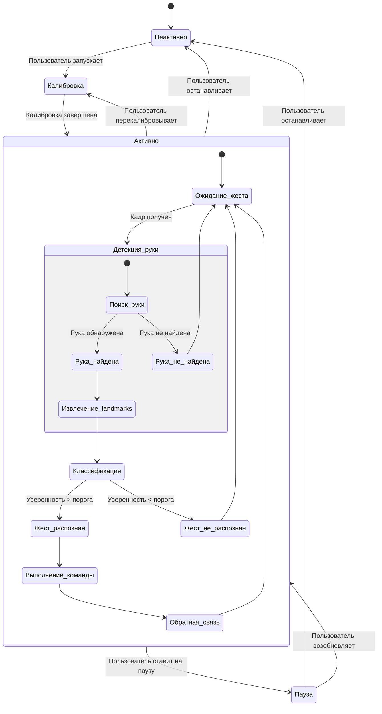

# 📊 Моделирование проекта HandCursor

## 🧠 Ментальная карта проекта

## 🔄 Декомпозиция (IDEF0)

## 📈 DFD Диаграмма контекста 0

## DFD Диаграмма контекста 1

## Модель в нотации BPMN

## Модели в нотации UML - структурная

## Модели в нотации UML - поведенческая 1

## Модели в нотации UML - поведенческая 2

      - pinch: "left_click"
      - victory: "right_click"
      - fist: "drag"
      - thumbs_up: "scroll_up"
