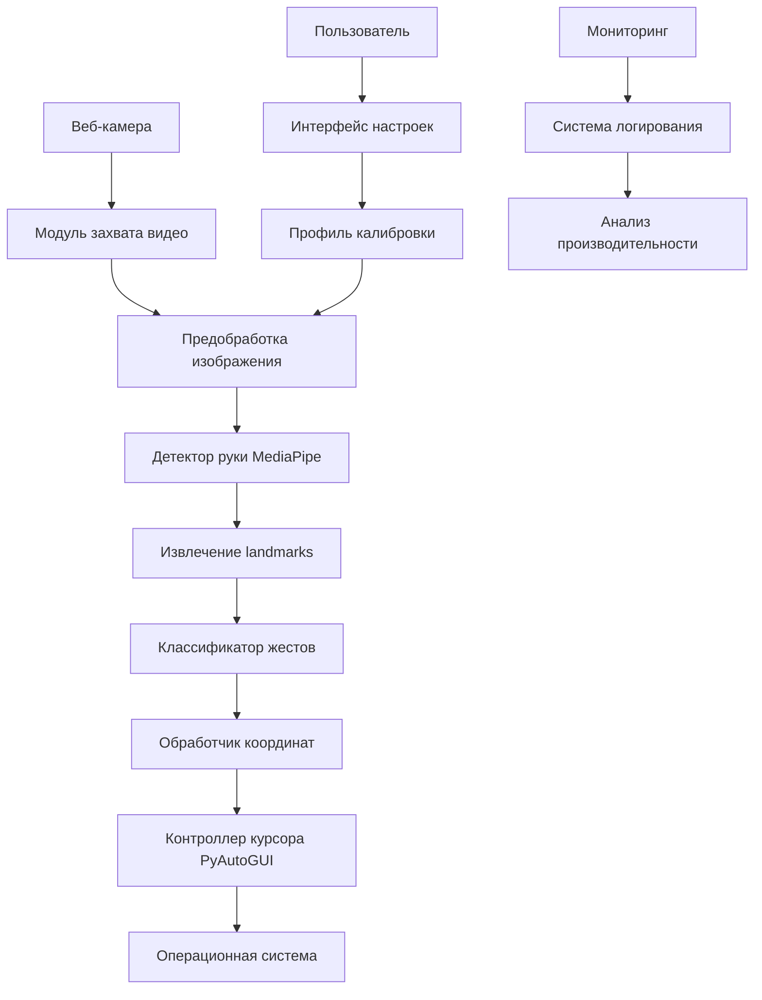

# 📚 **Техническая документация HandCursor**

## 📋 **Содержание технической документации**

1. [📊 Технические характеристики](#-технические-характеристики)
2. [🏗️ Архитектура системы](#️-архитектура-системы)
3. [🔧 Технологический стек](#-технологический-стек)
4. [📁 Структура проекта](#-структура-проекта)
5. [🎯 Функциональные возможности](#-функциональные-возможности)
6. [🧪 Тестирование и валидация](#-тестирование-и-валидация)


---

## 📊 **Технические характеристики**

### **Общие параметры**

| Параметр | Значение | Описание |
|----------|----------|----------|
| **Версия API** | v1.0 | Версия программного интерфейса |
| **Протокол обмена данными** | Локальный IPC | Внутрипроцессное взаимодействие |
| **Поддерживаемые ОС** | Windows 10+, macOS 10.15+, Ubuntu 18.04+ | Кроссплатформенность |
| **Язык реализации** | Python 3.7+ | Основной язык программирования |
| **Лицензия** | MIT | Тип лицензирования |

### **Параметры точности**

| Параметр | Значение | Метод измерения |
|----------|----------|-----------------|
| **Точность позиционирования** | ±5-15 пикселей | Стандартное отклонение |
| **Точность классификации жестов** | - | Тестовая выборка 1000 жестов |
| **Стабильность трекинга** | - | Непрерывное отслеживание 5 мин |
| **Частота ложных срабатываний** | - | Тестирование в различных условиях |

### **Параметры производительности**

| Параметр | Значение | Описание |
|----------|----------|----------|
| **Задержка системы** | 50-150 мс | Время от движения руки до реакции курсора |
| **Частота обработки** | 15-30 FPS | Адаптивная, зависит от производительности системы |
| **Потребление CPU** | - | На процессорах среднего уровня |
| **Потребление RAM** | -| Включая все библиотеки и модели |
| **Поддерживаемые разрешения** | 640x480 - 1920x1080 | Автоматическая адаптация |


---

## 🏗️ **Архитектура системы**

### **Высокоуровневая архитектура**




### **Компонентная модель**

#### **1. Модуль ввода данных**
- **Видеозахват**: OpenCV VideoCapture
- **Предобработка**: Коррекция освещения, фильтрация шумов
- **Буферизация**: Кольцевой буфер для стабильного FPS

#### **2. Модуль компьютерного зрения**
- **Детекция руки**: MediaPipe Hands (21 landmark)
- **Трекинг**: Алгоритм оптического потока
- **Стабилизация**: Фильтр Калмана для сглаживания

#### **3. Модуль машинного обучения**
- **Классификация жестов**: CNN архитектура
- **Извлечение признаков**: Spatial features из landmarks
- **Обучение модели**: Transfer learning на датасете жестов

#### **4. Модуль управления интерфейсом**
- **Преобразование координат**: Аффинные преобразования
- **Управление курсором**: PyAutoGUI интеграция
- **Обработка событий**: Event-driven архитектура

#### **5. Модуль пользовательского интерфейса**
- **Настройки**: PyQt5 графический интерфейс
- **Калибровка**: Интерактивный помощник
- **Статистика**: Реалтайм метрики производительности


---

## 🔧 **Технологический стек**

### **Основные технологии**

| Технология | Версия | Назначение |
|------------|--------|------------|
| **Python** | 3.9+ | Основной язык программирования |
| **OpenCV** | 4.5+ | Компьютерное зрение, обработка видео |
| **MediaPipe** | 0.8+ | Детекция и трекинг руки |
| **PyAutoGUI** | 0.9+ | Управление курсором и клавиатурой |
| **NumPy** | 1.21+ | Математические операции, массивы |
| **TensorFlow** | 2.8+ | Машинное обучение, классификация |

### **Вспомогательные библиотеки**

| Библиотека | Назначение |
|------------|------------|
| **PyQt5** | Графический пользовательский интерфейс |
| **SciPy** | Научные вычисления, фильтры |
| **Matplotlib** | Визуализация данных, графики |
| **Pandas** | Обработка табличных данных |
| **Logging** | Система логирования |
| **JSON** | Работа с конфигурационными файлами |

### **Инструменты разработки**

| Инструмент | Назначение |
|------------|------------|
| **Git** | Контроль версий |
| **PyTest** | Тестирование кода |
| **Black** | Форматирование кода |
| **Flake8** | Проверка стиля |

### **Поток обработки данных**
```
📷 Захват кадра (30 FPS)
↓
🔧 Предобработка (яркость, контраст, шум)
↓
✋ Детекция руки (MediaPipe → 21 точка)
↓
🎯 Классификация жеста (CNN модель)
↓
📐 Обработка координат (фильтрация, маппинг)
↓
🖱️ Генерация события (клик, перемещение)
↓
💻 Системная интеграция (PyAutoGUI)
↓
📊 Обратная связь (визуальная, статистика)
```
1. **Захват видео** - Получение кадров с веб-камеры с частотой 30 FPS
2. **Предобработка** - Коррекция освещения, удаление шумов, повышение контрастности
3. **Детекция руки** - Использование MediaPipe для определения положения руки и 21 ключевой точки
4. **Извлечение признаков** - Анализ положения и ориентации пальцев
5. **Классификация жестов** - Применение обученной нейронной сети для распознавания жеста
6. **Обработка координат** - Преобразование координат руки в координаты экрана с учетом калибровки
7. **Генерация событий** - Создание системных событий мыши и клавиатуры
8. **Обратная связь** - Визуальное и звуковое подтверждение действий


---

## 📁 **Структура проекта**

```
HandCursor/
│
├── 📁 docs/                           # Документация
│   ├── 📄 api.md                     # API документация
│   ├── 📄 architecture.md            # Архитектура системы
│   ├── 📄 gestures_guide.md          # Руководство по жестам
│   ├── 📄 installation_guide.md      # Руководство по установке
│   └── 📄 troubleshooting.md         # Решение проблем
│
├── 📁 src/                           # Исходный код
│   ├── 📁 core/                      # Основные модули
│   │   ├── 📄 video_capture.py       # Захват видео
│   │   ├── 📄 hand_detector.py       # Детектор руки
│   │   ├── 📄 gesture_classifier.py  # Классификатор жестов
│   │   ├── 📄 cursor_controller.py   # Контроллер курсора
│   │   └── 📄 calibration.py         # Калибровка
│   │
│   ├── 📁 ui/                        # Пользовательский интерфейс
│   │   ├── 📄 main_window.py         # Главное окно
│   │   ├── 📄 calibration_gui.py     # Интерфейс калибровки
│   │   └── 📄 gesture_guide.py       # Руководство по жестам
│   │
│   ├── 📁 utils/                     # Вспомогательные модули
│   │   ├── 📄 config_manager.py      # Менеджер конфигурации
│   │   ├── 📄 logger.py              # Логирование
│   │   └── 📄 math_utils.py          # Математические функции
│   │
│   ├── 📁 models/                    # ML модели
│   │   └── 📁 trained_models/        # Обученные модели
│   │
│   ├── 📁 data/                      # Данные и ресурсы
│   │   ├── 📁 calibration_profiles/  # Профили калибровки
│   │   ├── 📁 gesture_dataset/       # Датсет жестов
│   │   └── 📄 default_config.json    # Конфигурация по умолчанию
│   │
│   ├── 📁 tests/                     # Тесты
│   │   ├── 📄 test_video_capture.py
│   │   ├── 📄 test_hand_detector.py
│   │   └── 📄 test_gesture_classifier.py
│   │
│   └── 📄 main.py                    # Точка входа
│
├── 📄 requirements.txt               # Зависимости Python
├── 📄 requirements-dev.txt           # Зависимости для разработки
├── 📄 LICENSE                        # Лицензия MIT
├── 📄 CONTRIBUTING.md                # Руководство для контрибьюторов
└── 📄 README.md                      # Этот файл
```

### **ER-диаграмма системы**

```mermaid
erDiagram
    USER ||--o{ PROFILE : "настраивает"
    USER ||--o{ GESTURE_HISTORY : "выполняет"
    USER ||--o{ PERFORMANCE : "отслеживает"
    PROFILE ||--o{ GESTURE_CONFIG : "содержит"
    GESTURE ||--o{ GESTURE_CONFIG : "используется в"
    
    USER {
        int id PK "ID пользователя"
        string username "Имя пользователя"
        string email "Email"
        datetime created "Дата регистрации"
    }
    
    PROFILE {
        int id PK "ID профиля"
        int user_id FK "ID пользователя"
        string name "Название профиля"
        float sensitivity "Чувствительность (0.1-1.0)"
        float smoothing "Сглаживание"
        bool is_default "Профиль по умолчанию"
    }
    
    GESTURE {
        int id PK "ID жеста"
        string name "Название жеста"
        string code "Код жеста"
        string icon "Иконка"
        string action "Действие по умолчанию"
    }
    
    GESTURE_CONFIG {
        int id PK "ID конфигурации"
        int profile_id FK "ID профиля"
        int gesture_id FK "ID жеста"
        string action "Назначенное действие"
        int priority "Приоритет"
    }
    
    GESTURE_HISTORY {
        int id PK "ID записи"
        int user_id FK "ID пользователя"
        int gesture_id FK "ID жеста"
        float confidence "Точность"
        datetime timestamp "Время выполнения"
        json coordinates "Координаты"
    }
    
    PERFORMANCE {
        int id PK "ID записи"
        int user_id FK "ID пользователя"
        float fps "Частота кадров"
        float latency "Задержка (мс)"
        float cpu "Использование CPU (%)"
        datetime timestamp "Время измерения"
    }
